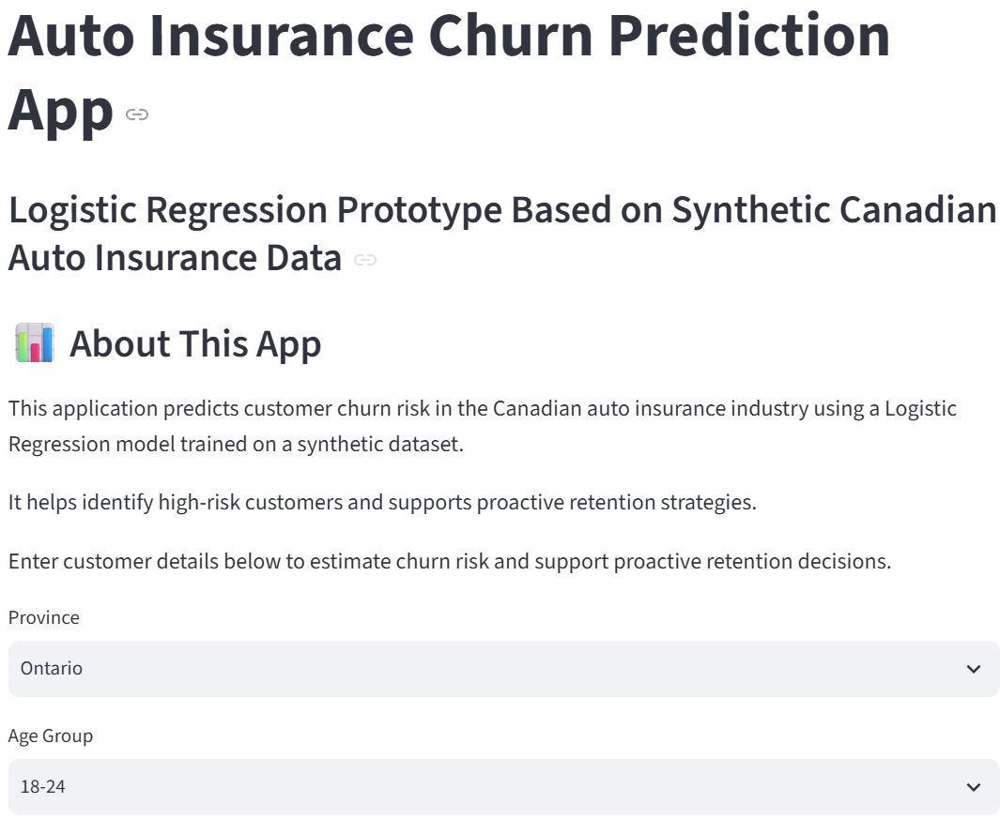
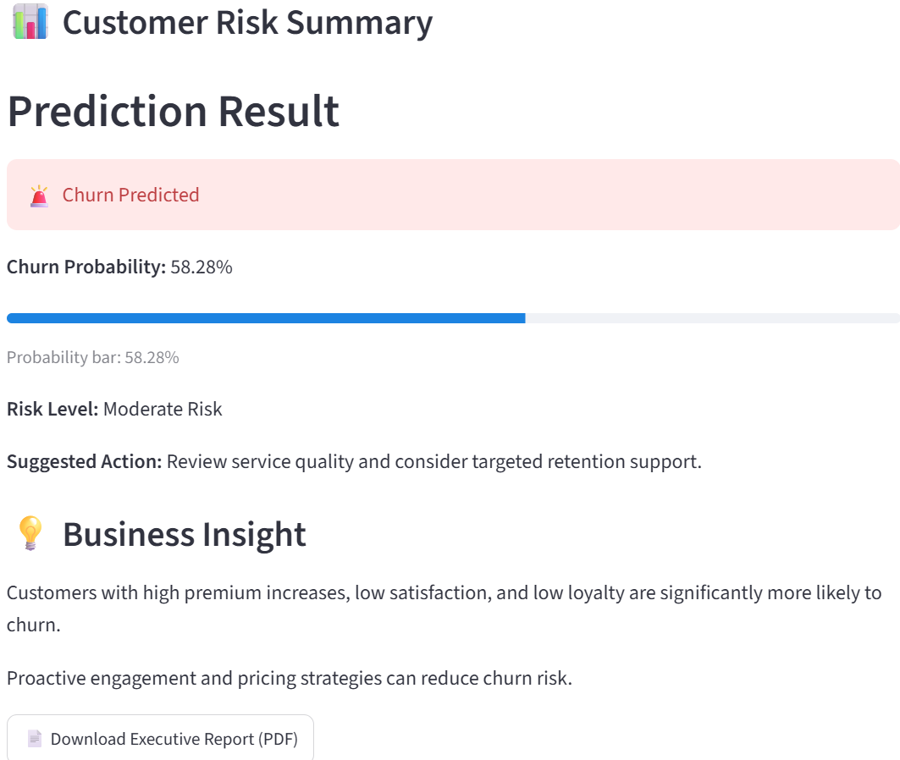
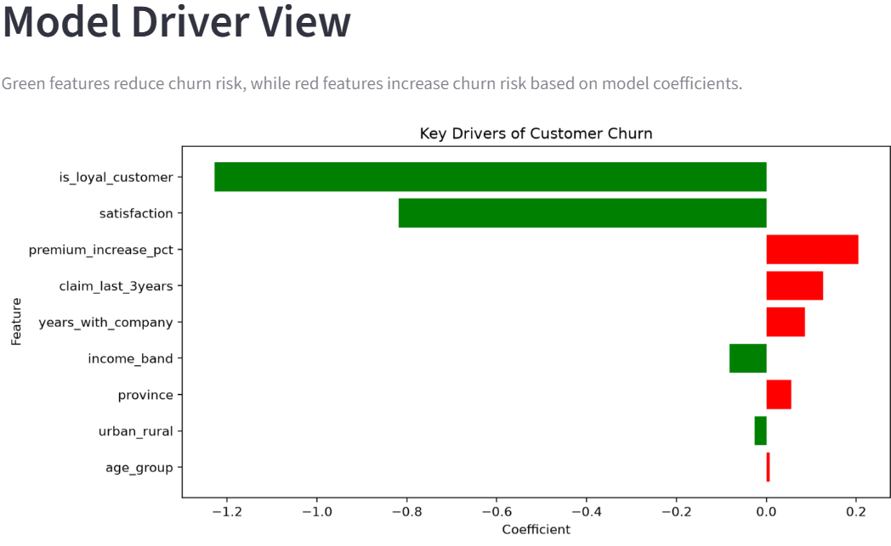
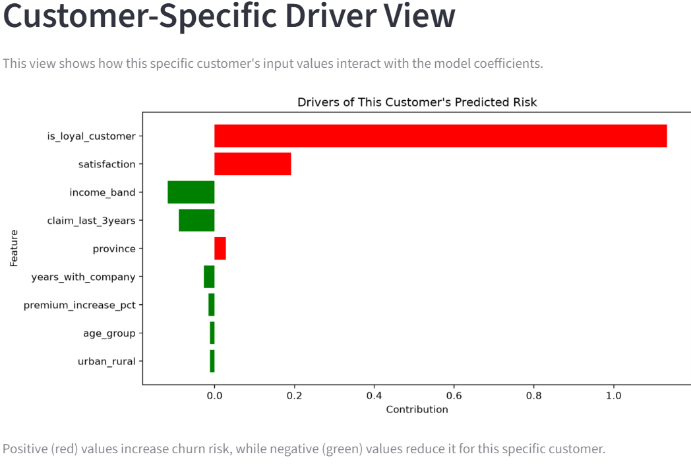

# Auto Insurance Customer Churn Prediction

### Predictive Analytics | Machine Learning | Customer Retention

A Python-based predictive analytics project investigating customer churn in the Canadian auto insurance industry.

The project combines exploratory data analysis, machine learning, model explainability, and an interactive Streamlit application to identify customers at risk of leaving and support data-driven retention strategies.

**[Launch the Interactive Churn Prediction App](https://auto-insurance-churn-app.streamlit.app)**

## 1. Business Problem

Customer churn presents a significant challenge for auto insurance companies. Losing customers affects revenue, increases replacement costs, and creates uncertainty around long-term customer relationships.

This project explores how customer characteristics, premium increases, satisfaction, claims history, and loyalty influence churn risk.

The objective is to identify customers at risk of leaving and provide actionable insights to support customer retention.

## 2. Dataset

The analysis uses a synthetic dataset containing 10,000 Canadian auto insurance customers.

Key variables include:

- Province and geographic classification
- Age group and income band
- Years with the insurance company
- Claims history
- Premium increase percentage
- Customer satisfaction score
- Customer loyalty
- Customer churn status

**Note:** The dataset is synthetic and was developed for academic demonstration. Findings should not be interpreted as actual Canadian insurance industry statistics.

Dataset: `churn_dataset_Mar30.csv`

## 3. Exploratory Data Analysis

Exploratory analysis investigated relationships between customer characteristics and churn.

Key patterns included:

- Higher premium increases were associated with greater churn risk.
- Lower satisfaction scores were concentrated among customers who churned.
- Customers with shorter tenure showed greater vulnerability to churn.
- Customer loyalty was associated with reduced churn risk.
- The dataset exhibited class imbalance.

These findings informed the predictive modelling approach and retention recommendations.

## 4. Machine Learning Models

Three classification algorithms were evaluated:

1. Logistic Regression
2. Decision Tree
3. Random Forest

### Model Performance

| Model | Accuracy | Churn Recall |
|---|---:|---:|
| Logistic Regression | ~77% | ~65% |
| Decision Tree | ~82% | ~33% |
| Random Forest | ~87.7% | ~16% |

**Selected Model: Logistic Regression**

Logistic Regression was selected because it identified a greater proportion of customers who churned, despite having lower overall accuracy than the other models.

For customer retention, identifying at-risk customers is particularly important because missed churn cases represent potential lost opportunities for intervention.

The model also offers interpretable coefficients that support business-focused explanations.

## 5. Interactive Streamlit Application

An interactive Streamlit application was developed to demonstrate how predictive analytics can support customer retention decisions.

The application enables users to:

- Enter customer demographic and insurance information
- Generate customer churn predictions
- View estimated churn probabilities
- Identify customer risk categories
- Receive suggested retention actions
- Explore overall model drivers
- Examine customer-specific model contributions
- Download an executive PDF report

**[View the Live Application](https://auto-insurance-churn-app.streamlit.app)**

Application source code: [Auto Insurance Churn App Repository](https://github.com/nnamdionu/auto-insurance-churn-app)

### Customer Information Input

Users provide customer information to generate an estimated churn risk.

### Churn Prediction and Business Recommendations

The application displays the predicted churn outcome, estimated probability, risk classification, and suggested retention action.

### Overall Model Drivers

The model driver visualization illustrates the direction and relative magnitude of Logistic Regression coefficients.

### Customer-Specific Risk Drivers

This visualization shows how individual customer inputs contribute to the model's prediction.

## 6. Business Recommendations

Based on the analysis, the following strategies were proposed:

**Manage Premium Increases**

Review significant premium adjustments and improve communication with customers about pricing changes.

**Improve Customer Satisfaction**

Strengthen service quality, customer engagement, and responsiveness to customer concerns.

**Prioritize Early Customer Retention**

Focus retention initiatives on customers in the early years of their relationship with the company.

**Implement Risk-Based Engagement**

Use predictive churn scores to help prioritize customers for proactive retention outreach.

## 7. Tools and Technologies

- Python
- Pandas
- Scikit-learn
- Jupyter Notebook
- Logistic Regression
- Decision Trees
- Random Forest
- Streamlit
- Data Visualization
- Predictive Analytics
- Model Explainability

## 8. Project Files

- `Final_Auto_Insurance_Churn_Canada_Mar31.ipynb` — Data analysis and machine learning notebook
- `churn_dataset_Mar30.csv` — Synthetic customer dataset
- `churn-input.png` — Application input interface
- `churn-prediction.png` — Prediction results
- `churn-model-drivers.png` — Overall model drivers
- `churn-customer-drivers.png` — Customer-specific model contributions

## 9. Project Context

This project was developed as part of the Seneca Polytechnic Business Analytics capstone.

**Project Team**

- Nnamdi Onu — Data Preparation
- Tsz Yan Chan — Project Lead
- Fisayo Adeyinka — Reporting
- Adedoyin Osokoya — Modelling

## 10. Author and Portfolio

**Nnamdi Onu**

Business Analyst | Data Analyst | Business Intelligence

- [Professional Portfolio](https://nnamdionu.github.io/)
- [GitHub](https://github.com/nnamdionu)
- [LinkedIn](https://www.linkedin.com/in/nnamdi-onu-828a5b90/)

---

*This project uses synthetic data and is intended for educational and portfolio demonstration purposes.*
